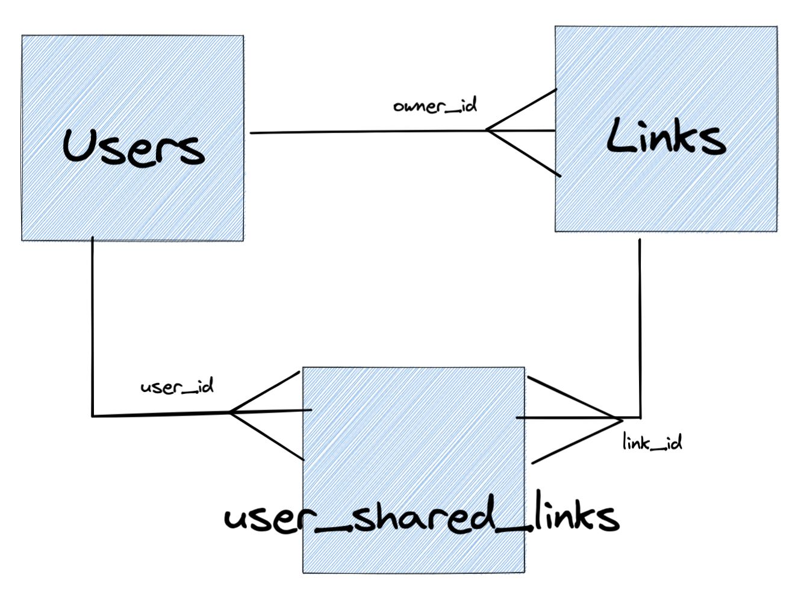

# Refactor Roadmap
### Örnek Proje İçeriği
**Uygulama Özeti**: URL Shorter

**Uygulama Yapısı**: 
- users
  - ID **uint**
  - Email **string**
  - Password **string**

- links
  - ID **uint**
  - LongUrl **string**
  - ShortenURLPath **string**
  - CreatedAt **time**
  - IsDeleted **boolean**
  - OwnerID **uint**

- user_shared_links
  - userID **uint**
  - linkID **uint**

##DB Diagram

## Refactor Öncesi
### Klasör Yapısı:
- app: Uygulamanın çalıştığı klasör
- config: Projenin ayarlarını kapsar.
- controller: Yönlendirmelerin methodlarını barındırılır.
- db: Veritabanı bağlantı kütüphanelerini barındırılır
- model: Veritabanı şemalarını barındırılır.
- schema: Response ve Request Body'ler barındırılır.
- router: Yönlendirmeleri barındırır.

## Refactor Sonrası
- cmd:
- internal:
  - core:
    - domain:
    - service:
    - handler:
    - usecase:
    - repository:
- pkg:
  - mocks:
  - database:
    - 