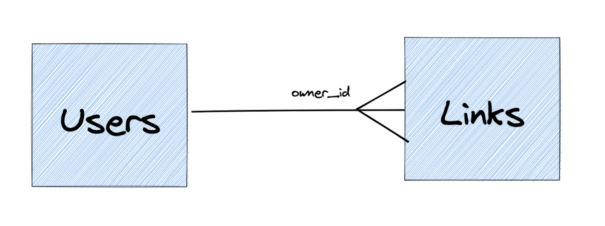

# Refactor Roadmap "TR"
**NOTE:** I will complete readme.md in English.

### Örnek Proje İçeriği
**Uygulama Özeti**: URL Shorter

**Uygulama Yapısı**: 
- users
  - ID **uint**
  - Email **string**
  - Password **string**

- links
  - ID **uint**
  - LongUrl **string**
  - ShortenURLPath **string**
  - CreatedAt **time**
  - IsDeleted **boolean**
  - OwnerID **uint**

- user_shared_links
  - userID **uint**
  - linkID **uint**

##DB Diagram

## Refactor Öncesi
### Klasör Yapısı:
- app: Uygulamanın çalıştığı klasör
- config: Projenin ayarlarını kapsar.
- controller: Yönlendirmelerin methodlarını barındırılır.
- db: Veritabanı bağlantı kütüphanelerini barındırılır
- model: Veritabanı şemalarını barındırılır.
- schema: Response ve Request Body'ler barındırılır.
- router: Yönlendirmeleri barındırır.

### Refactor Sonrası
### Klasör Yapısı:
- cmd: ...
  - link: ...
  - user: ...
  - single: Tüm Handlerların tek noktadan derlenmesi içindir
- internal: ...
  - core: ...
    - domain: ...
    - service: ...
    - handler: ...
    - usecase: ...
    - repository: ...
- pkg: ...
  - database: ...
    - postgres: ...

## Refactor Adımları
#### v1.0.0
- [X] Klasör Yapısının Kurgulanması
- [X] Mockery kütüphanesi eklenmesi
- [X] Logrus kütüphanesi eklenmesi
- [X] Repository Interfacelerinin oluşturulması
  - [X] Mock Repository Oluşturulması
  - [X] GormDB Repository Oluşturulması
- [X] Modellerin Domain katmanına taşınması
- [X] Usecaselerin Oluşturulması
- [X] Servislerin Oluşturulması
  - [X] Mock Service oluşturulması
  - [X] V1 Service oluşturulması
- [X] Handlerların Oluşturulması
  - [X] apiV1 Handler oluşturulması
- [X] Testlerin Yazılması
  - [X] Repository Testlerinin Yazılması
  - [X] Service Testlerinin Yazılması
  - [X] Handler Testlerinin Yazılması
- [X] Makefile eklenmesi
#### v1.5.0
- [ ] Dockerfile eklenmesi
- [ ] Docker Compose eklenmesi
- [ ] Swagger entegrasyonu
#### v2.0.0
- [ ] Çoklu Handler çalıştırma mekaniğinin eklenmesi
- [ ] Docker Compose entegrasyonu